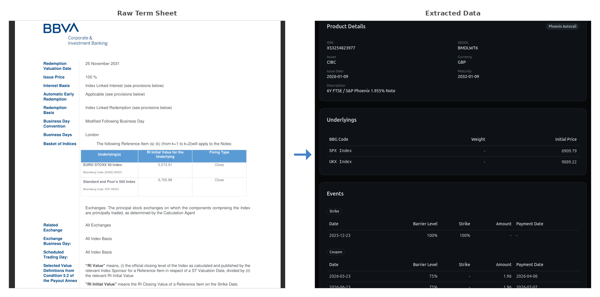
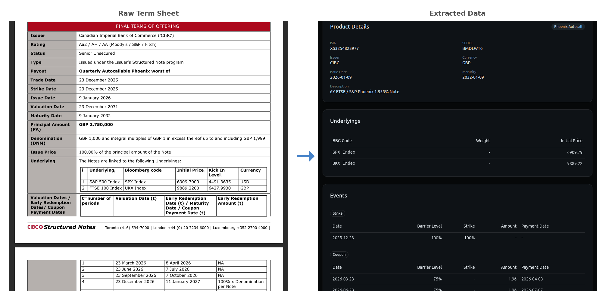

# Termsheet extractor

This is a termsheet extractor demo using LLM tool-use to pull product data from variously formatted financial termsheet PDFs into a standardised PostgreSQL database. 

The LLM is equipped with tools to search & read the document, and is guided through a multi-phase extraction protocol. The agent locates fields (ISIN, dates, underlyings, barrier levels, event schedules) by querying the document directly, grounding every extracted value in the source text. 

This tool-use approach significantly reduces hallucinations compared to one-shot extraction and combined with schema validation and business rule checks, ensures clean data.

### Examples

## Getting Started

### Install
#### Prerequisites
1. [Docker compose](https://docs.docker.com/compose/install/)
2. Get an API key from [Synthetic](https://dev.synthetic.new/docs/api/models)
3. Environment variables, use `./backend/.env.example` as a template for your `.env`
#### Run
1. `cd backend`
2. `docker compose up`

### Usage
1. Upload a PDF, view the extracted term sheet, hit approve to save.

### Test
1. `cd backend`
2. `docker compose --profile test up test`

## Next Steps

### SLDC
- **Ticketing** - Introduce ticketing system & agile project management for prioritisation

### Optimisation
- **Observability** - structured logging, tracing per agent run, token/cost metrics
- **Deterministic extraction** - replace LLM for well-known fields (ISIN, dates, currency) with rule-based parsers
- **Confidence scoring** - per field confidence so reviewers know where to focus

### New Features
- **Field-level editing** - correct individual fields before approval
- **Payoff diagrams** - visualise product outcomes at maturity
- **Scenario analysis** - model returns under bull/bear/flat scenarios
- **Product comparison** - compare extracted notes against each other or direct index ownership

### Infrastructure
- **Auth** - add authentication to API endpoints
- **Task queue** - replace in-memory job store with Redis/Celery
- **SPA served by FastAPI** - this won't scale!
- **CI/CD** - automated deploy pipeline
- **Licensing concerns** - replace pymupdf4llm (AGPL) with pdfplumber (MIT)
